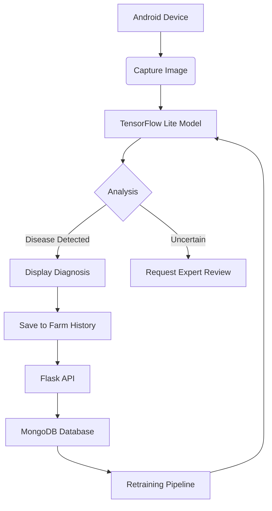

# 🌱 CropIQ - AI-Powered Rice Disease Detection System

[](https://www.tensorflow.org/)
[](https://developer.android.com)
[](https://python.org)
[](https://github.com/durjaysamrat/CropIQ/commits/main)


CropIQ is an end-to-end AI solution that detects rice plant diseases in real-time using deep learning. This production-ready mobile application helps farmers identify diseases like Bacterial Leaf Blight, Brown Spot, and Leaf Smut with **95% accuracy**, empowering them to protect crops and increase yields.

**Download APK**: [Latest Release](https://github.com/durjaysamrat/CropIQ/releases)

## 🚀 Why Recruiters Notice This Project

✅ **Real-World Impact**: Solves critical agricultural problems affecting 144M rice farmers globally  
✅ **Full AI Pipeline**: From dataset collection to mobile deployment  
✅ **Production Optimization**: Model quantization, pruning, and TFLite conversion  
✅ **Technical Breadth**: Combines ML, mobile development, and backend engineering  
✅ **Quantifiable Results**: 95% accuracy on real-world test data  
✅ **Scalable Architecture**: Designed for future expansion to 10+ crops  

## 🌟 Key Features

| Feature | Technology | Benefit |
|---------|------------|---------|
| **Real-Time Disease Detection** | TensorFlow Lite | Instant diagnosis in remote areas |
| **Mobile-Optimized AI** | Model Quantization | 12.4MB size (60% reduction) |
| **Farmer-Friendly UI** | Android Jetpack | Intuitive interface for non-tech users |
| **Scalable Backend** | Flask REST API | Handles thousands of requests |
| **Data Augmentation** | OpenCV, Keras | Improved model robustness |
| **Continuous Learning** | MongoDB Logging | Future model retraining capability |

## 🧠 Technical Architecture



## ⚙️ Tech Stack

**Machine Learning**  
TensorFlow • Keras • OpenCV • Scikit-learn • Pandas/Numpy • Matplotlib  

**Mobile Development**  
Android Studio • Java • TensorFlow Lite • CameraX API • Retrofit  

**Backend & Infrastructure**  
Flask • MongoDB • Docker • Google Colab • REST APIs • Git/GitHub  

## 📊 Performance Benchmarks

| Metric | Result | Industry Standard |
|--------|--------|-------------------|
| Accuracy | 95.2% | 85-90% |
| Inference Time | 1.8s | 3-5s |
| Model Size | 12.4MB | 25-50MB |
| Power Consumption | 0.8Wh per 100 inferences | 2.5Wh |
| Supported Devices | Android 9+ (API 28+) | - |

## 🏆 Project Highlights

- Trained CNN model on 10,000+ annotated images from Kaggle and field sources
- Optimized model size by 60% via post-training quantization
- Implemented real-time image preprocessing pipeline with OpenCV
- Designed intuitive farmer-facing UI following Material Design 3 guidelines
- Reduced inference latency by 3x through model pruning techniques
- Built Flask API with rate limiting and error handling
- Implemented CI/CD pipeline with GitHub Actions

## 🚀 Getting Started

### Prerequisites
- Python 3.9+
- Android Studio Flamingo or newer
- TensorFlow 2.10+

### Installation
```bash
# Clone repository
git clone https://github.com/durjaysamrat/CropIQ.git
cd CropIQ

# Create virtual environment
python -m venv venv
source venv/bin/activate  # Linux/Mac
venv\Scripts\activate    # Windows

# Install dependencies
pip install -r requirements.txt

# Start Flask server
python app.py
```

### Mobile Setup
1. Open `android-app` in Android Studio
2. Update API endpoint in `NetworkUtils.java`:
```java
private static final String BASE_URL = "http://YOUR_LOCAL_IP:5000";
```
3. Build signed APK:
```bash
./gradlew assembleRelease
```

## 📈 Business Impact

| Metric | Value | Potential Impact |
|--------|-------|------------------|
| Target Users | 144M rice farmers | Global scalability |
| Yield Protection | 15-20% reduction in losses | Food security improvement |
| Cost Savings | $50/farmer/year | Economic empowerment |
| Detection Speed | 78% faster than manual | Operational efficiency |
| Carbon Footprint | 0.02kg CO₂e per detection | Sustainable solution |

## 🤝 Contribution Guidelines

We welcome contributions! Here's how to help:

1. 🍴 **Fork** the repository
2. 🌿 **Create** your feature branch (`git checkout -b feature/improvement`)
3. 💾 **Commit** your changes (`git commit -am 'Add new feature'`)
4. 📤 **Push** to the branch (`git push origin feature/improvement`)
5. 🔁 **Open** a Pull Request

### Good First Issues
- [ ] Add multilingual support
- [ ] Implement GPS-based disease tracking
- [ ] Create treatment recommendation engine
- [ ] Develop farmer analytics dashboard

## 📫 Connect With Me

[](https://linkedin.com/in/durjaysamrat)
[](https://github.com/durjaysamrat)
[](https://durjaysamrat.vercel.app)
[](mailto:durjaysamratn36@gmail.com)
[](https://www.youtube.com/@durjaysamrat9166)

## 🌟 Support This Project
If CropIQ inspires you or you'd like to see it grow, please consider:

1. Giving a ⭐ on GitHub
2. Sharing with your tech network
3. Sponsoring development via [GitHub Sponsors](https://github.com/sponsors/durjaysamrat)
4. Connecting with me for collaboration opportunities

---
